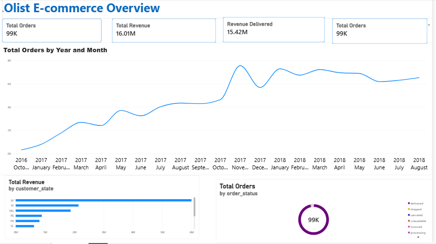
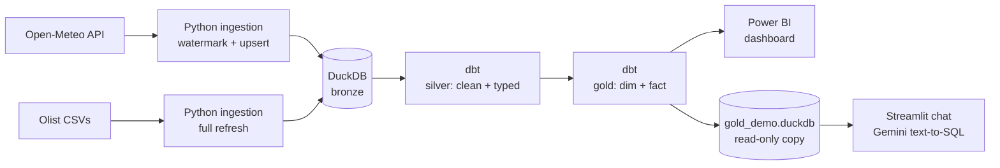
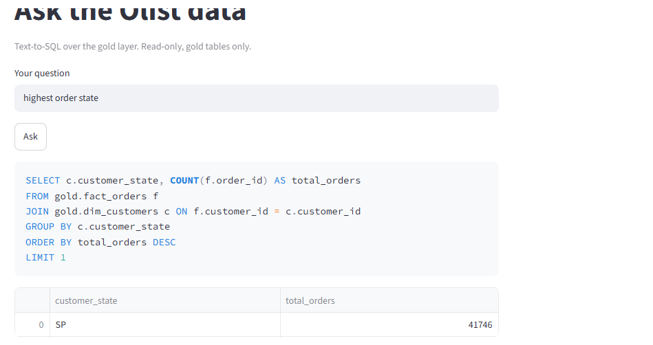

# Data Engineering Portfolio: incremental pipeline with DuckDB, dbt, Power BI and an LLM chat

An end-to-end data pipeline built on free tools. It ingests a public weather API incrementally and an e-commerce dataset (Olist) in batch, models both with dbt into bronze, silver and gold layers, serves the gold tables to a Power BI dashboard, and lets you ask questions about them in plain English through a read-only text-to-SQL chat.



## Architecture



| Layer | What it holds | Built by |
| --- | --- | --- |
| bronze | Raw data as loaded, plus `loaded_at` and source file | Python scripts in `ingestion/` |
| silver | Cleaned, typed tables (orders, customers, items, payments) | dbt models in `dbt_project/models/silver` |
| gold | `dim_customers` and `fact_orders` (one row per order) | dbt models in `dbt_project/models/gold` |

## Tech stack

Python, DuckDB, dbt Core (dbt-duckdb), Power BI Desktop, Streamlit, Gemini API, Git.

## Data sources

- **Open-Meteo archive API** (no API key): daily temperature and precipitation for three cities. Used to demonstrate incremental loading.
- **Olist Brazilian E-Commerce dataset** (Kaggle, CSV): about 99k orders. A static dataset, loaded as a full refresh.

## Key design decisions

1. **Incremental load with a watermark.** `load_weather.py` stores the last loaded date in `bronze.etl_control` and fetches only newer data. A 2-day overlap window covers late-arriving data.
2. **Idempotent loads.** Rows are upserted on a primary key (`city`, `obs_date`), so re-running the script never creates duplicates. Running it twice kept the row count unchanged at 644 per city.
3. **Load strategy follows the source.** The API changes daily, so it uses watermark plus upsert. Olist is static, so a full refresh is simpler and safe.
4. **Data quality checks in dbt.** `unique` and `not_null` tests on primary keys, and a `relationships` test between `fact_orders` and `dim_customers`.
5. **Layered modelling.** Bronze stays raw, silver cleans and types, gold is shaped for reporting, so each layer has one job.
6. **Defence in depth for the LLM chat.** The model never touches the main warehouse. See the next section.

## Results

- `gold.fact_orders` has 99,441 rows, matching the Olist order count, so the joins did not drop or duplicate orders.
- The dashboard shows total orders, revenue, delivered revenue, average order value, monthly orders, top 10 states by revenue and the order status split. Revenue is in BRL.
- The chat returns the same answers as the dashboard. For example, it ranks SP first by revenue and orders, and counts 625 canceled orders.

## Ask the data (LLM chat)

A Streamlit app that turns a plain-English question into SQL with the Gemini API and runs it on the gold layer. The generated SQL is always shown, so the answer can be verified.



Safety measures:

- The app opens a separate `gold_demo.duckdb` that contains only the gold tables, in read-only mode. It cannot reach bronze or silver.
- Only a single SELECT query is allowed. Write statements and file-reading functions are blocked by a keyword filter.
- Results are capped with `LIMIT 200`.
- Transient API errors (503) are retried with a short backoff.
- The API key lives in `.env`, which is not committed.

Known limitations:

- Text-to-SQL can be wrong, so the SQL is displayed next to every result.
- The keyword filter is conservative and can block a harmless query that merely contains a blocked word. The read-only connection is the real safeguard, the filter is an extra layer.

## How to run

```bash
# 1. Set up
python -m venv .venv
.venv\Scripts\activate          # Mac/Linux: source .venv/bin/activate
pip install -r requirements.txt

# 2. Ingest
python ingestion/load_weather.py
# download the Olist CSVs from Kaggle into data/raw/olist/
python ingestion/load_olist.py

# 3. Transform and test
cd dbt_project
dbt run --profiles-dir .
dbt test --profiles-dir .
cd ..

# 4. Export gold tables for Power BI
python export/export_gold.py

# 5. Run the LLM chat
python export/make_gold_demo.py
streamlit run app/app.py
```

For the chat, create a `.env` file in the project root with a free Gemini API key from Google AI Studio:

```
GEMINI_API_KEY=your_key
GEMINI_MODEL=gemini-flash-latest
```

Open `docs/olist_dashboard.pbix` in Power BI Desktop and point the two CSV sources to `data/export/`.

## Project structure

```
ingestion/      Python loaders (weather API, Olist CSVs)
dbt_project/    dbt models (silver, gold), tests and profiles
export/         Gold table exports (CSV for Power BI, read-only DuckDB for the chat)
app/            Streamlit text-to-SQL chat
docs/           Dashboard file and screenshots
```

## Roadmap

- GitHub Actions workflow for a daily scheduled run plus dbt tests on every push
- dbt docs and lineage screenshot
